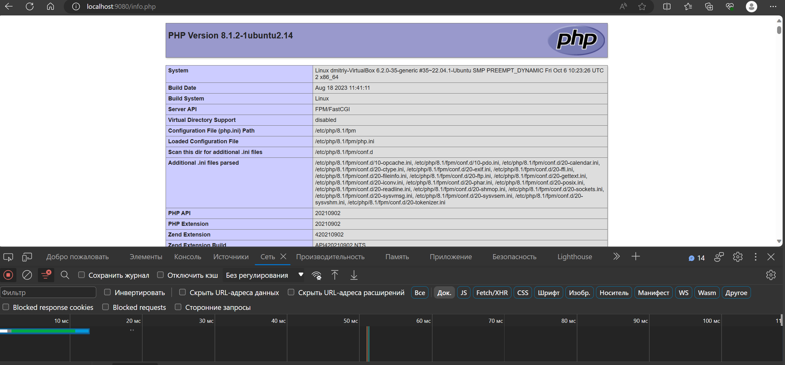

## LinuxLesson6
Работал под правами root(sudo su)
#### Установить Nginx и настроить его на работу с PHP-FPM.
 * sudo apt install nginx - установка веб-сервера
 * sudo apt install php8.1-fpm -установка сервера
 * cd /etc/nginx/sites-enabled - открываем каталог с default конфигом(настройки хоста) и добавляем туда 
     *      location / {
                # First attempt to serve request as file, then
                # as directory, then fall back to displaying a 404.
                # try_files $uri $uri/ =404;
                proxy_pass http://localhost:8080;
                proxy_set_header Host $host;
                proxy_set_header X-Forwarded-For $proxy_add_x_forwarded_for;
                proxy_set_header X-Real_IP $remote_addr;
            }

            # pass PHP scripts to FastCGI server
            #
            location ~ \.php$ {
                    include snippets/fastcgi-php.conf;
                    root /var/www/html;
                    # With php-fpm (or other unix sockets):
                    fastcgi_pass unix:/run/php/php8.1-fpm.sock;
                    # With php-cgi (or other tcp sockets):
                    #fastcgi_pass 127.0.0.1:9000;
           }
    далее сохраняем информация через Ctrl+O 
 * nginx -t - проверка, что все сделано без ошибок
 * systemctl reload nginx - перезагружаем сервер
 * теперь у нас будет отображаться php запрос, где можно будет увидеть, какой сервер API, какая конфигурация используется
 
#### Установить Apache. Настроить обработку PHP. Добиться одновременной работы с Nginx.
 * cd /etc/apache2 - переходим в каталог апачи 
 * nano ports.conf - меняем порт на любой можно взять для примера 8080
#### Настроить схему обратного прокси для Nginx (динамика - на Apache).
 *  nano /etc/nginx/sites-enabled/default - открываем файл
   *    перенаправляем на сервер apache динамику, а статистику оставляем на nginx
   *            server {
                listen 80 default_server;
                listen [::]:80 default_server;

                root /var/www/html;

                index index.html index.htm index.nginx-debian.html;

                server_name _;

                location / {
                       proxy_pass http://localhost:8080;
                       proxy_set_header Host Shost;
                       proxy_set_header X-Forwarded-For $proxy_add_x_forwarded_for;
                       proxy_set_header X-Real-IP Sremote_addr;
                }

                location ~* ^.+.(jpg|jpeg|gif|png|ico|css|zip|pdf|txt|tar|js)$ {
                   root /var/www/html;
                }
             } 
#### Установить MySQL. Создать новую базу данных и таблицу в ней.
* sudo mysql - заходим в БД
* CREATE DATABASE my_table; - слздаем таблицу 
* USE my_table; -  выбор активной БД
* CREATE TABLE new_table (id INT PRIMARY KEY AUTO_INCREMENT, name TEXT); - создание таблицы 
* INSERT INTO new_table (name) VALUES ('Dima'), ('Ilya'), ('John');- ввод данных в таблицу
* SELECT * FROM new_table; - показ таблицы
#### Установить пакет phpmyadmin и запустить его веб-интерфейс для управления MySQL.
* sudo apt install phpmyadmin - установка 
* CREATE USER 'sammy'@'localhost' IDENTIFIED WITH caching_sha2_password BY 'ПАРОЛЬ';
  GRANT ALL PRIVILEGES ON *.* TO 'sammy'@'localhost' WITH GRANT OPTION; - создаём пользователя, задаём пароль и задаём ему права
#### Настроить схему балансировки трафика между несколькими серверами Apache на стороне Nginx с помощью модуля ngx_http_upstream_module.
Не смог выполнить((