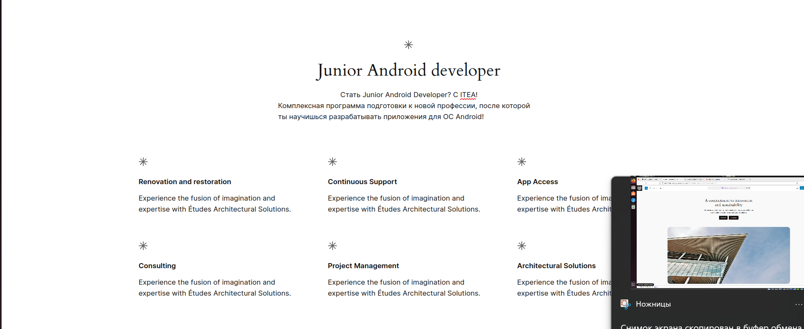

## LinuxLesson7

#### Установить в виртуальную машину или VDS Docker, настроить набор контейнеров через docker compose по инструкции.
* mkdir wordpress && cd wordpress - создание репозитория
* mkdir nginx-conf
* nano nginx-conf/nginx.conf - создание и открытия файла
* копитуем код для сервера
  *         server {
            listen 80;
          listen [::]:80;

          server_name example.com www.example.com;

          index index.php index.html index.htm;

          root /var/www/html;

          location ~ /.well-known/acme-challenge {
                  allow all;
                  root /var/www/html;
          }

          location / {
                  try_files $uri $uri/ /index.php$is_args$args;
          }

          location ~ \.php$ {
                  try_files $uri =404;
                  fastcgi_split_path_info ^(.+\.php)(/.+)$;
                  fastcgi_pass wordpress:9000;
                  fastcgi_index index.php;
                  include fastcgi_params;
                  fastcgi_param SCRIPT_FILENAME $document_root$fastcgi_script_name;
                  fastcgi_param PATH_INFO $fastcgi_path_info;
          }

          location ~ /\.ht {
                  deny all;
          }

          location = /favicon.ico {
                  log_not_found off; access_log off;
          }
          location = /robots.txt {
                  log_not_found off; access_log off; allow all;
          }
          location ~* \.(css|gif|ico|jpeg|jpg|js|png)$ {
                  expires max;
                  log_not_found off;
          }
}
#### Часть с настройкой certbot и HTTPS опустить, если у вас нет настоящего домена и белого IP.
* нету домена
#### Если не хотите - можно развернуть по простому, как делали на семинаре(WordPress). При желании, можете любой другой движок развернуть самостоятельно.
* mkdir test 
* nano Dockerfile
* прописываем в нем 
*     FROM ubuntu:22.04
      RUN apt-get update && \
          apt-get install -y nginx && \
          rm -rf /var/lib/apt/lists/*
      RUN echo 'Hi, I am in your container' \
              >/usr/share/nginx/html/index.html
      EXPOSE 5100
      CMD ["nginx", "-g", "daemon off;"]
* docker run -d -p 5100:80 cont_01 - для запуска 

#### Запустить два контейнера, связанные одной сетью (используя документацию).
#### Первый контейнер БД (например, образ mariadb:10.8), второй контейнер — phpmyadmin.
#### Получить доступ к БД в первом контейнере через второй контейнер (веб-интерфейс phpmyadmin).
* docker network creat my_network 
* docker run -d --name db --network my_network -e MYSQL_ROOT_PASSWORD=13254689 mariadb:10.8
* docker run -d --name myadmin --network my_network -e PMA_HOST=db -p 9000:80 phpmyadmin

