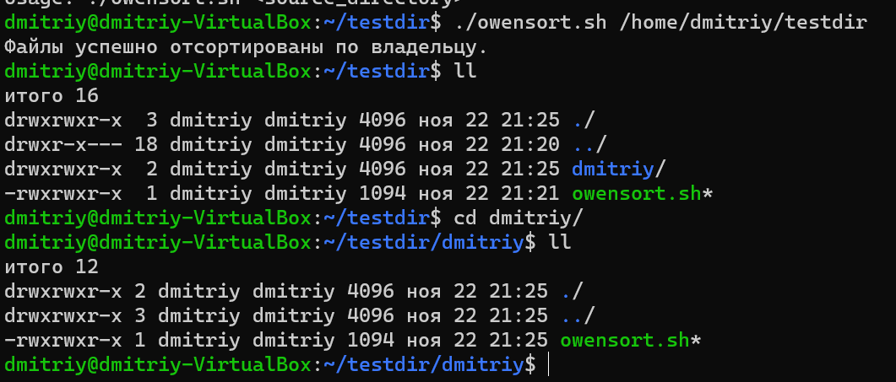

## LinuxLesson8
#### Написать скрипт очистки директорий. На вход принимает путь к директории. Если директория существует, то удаляет в ней все файлы с расширениями .bak, .tmp, .backup. Если директории нет, то выводит ошибку.
* touch filedeldir - создаем файл        
* после пишем сам скрипт управления
*      * #!/bin/bash
         read -p "Введите путь к директории или название директории: " DELDIRECTORY
         if [ -e $DELDIRECTORY ]
           then
             cd $DELDIRECTORY
             echo 'Удаление файлов, подождите'
             rm -v *.bak *.tmp. *.backup *.txt
         else
             exit 2
         fi
#### Создать скрипт ownersort.sh, который в заданной папке копирует файлы в директории, названные по имени владельца каждого файла. Учтите, что файл должен принадлежать соответствующему владельцу.
* mkdir testdir - создаем директорию
* touch owensort.sh - создаем файл
*              #!/bin/bash

               if [ "$#" -ne 1 ]; then
                 echo "Usage: $0 <source_directory>"
                 exit 1
               fi

               source_directory="$1"
               # Проверьте, существует ли исходный каталог
               if [ ! -d "$source_directory" ]; then
                 echo "Ошибка: Исходный каталог не существует."
                 exit 1
               fi

               # Пройдитесь по каждому файлу в исходном каталоге
               for file in "$source_directory"/*; do
                  # Проверьте, является ли элемент файлом
                  if [ -f "$file" ]; then
                  # Получить имя владельца файла
                  owner=$(stat -c "%U" "$file")

                     # Создайте каталог с именем владельца, если он не существует
                     if [ ! -d "$owner" ]; then
                        mkdir "$owner"
                     fi
                     # Скопируйте файл в каталог, названный в честь владельца
                     cp "$file" "$owner/"
                  fi
               done
               echo "Файлы успешно отсортированы по владельцу."
* 