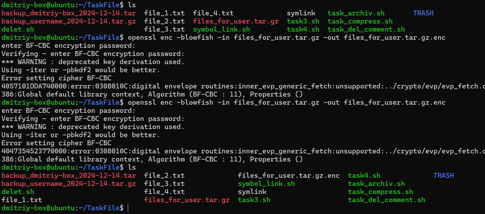
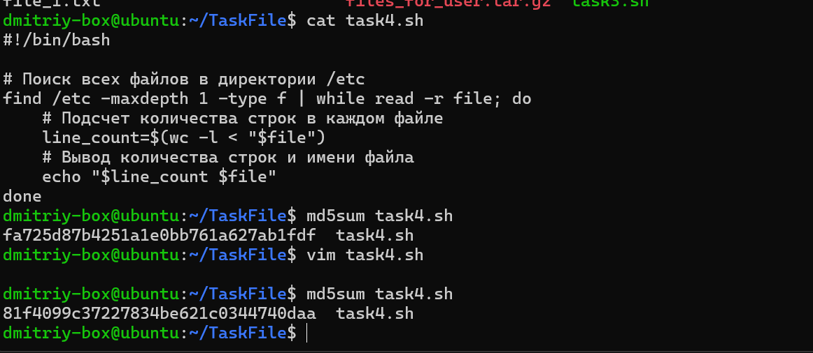
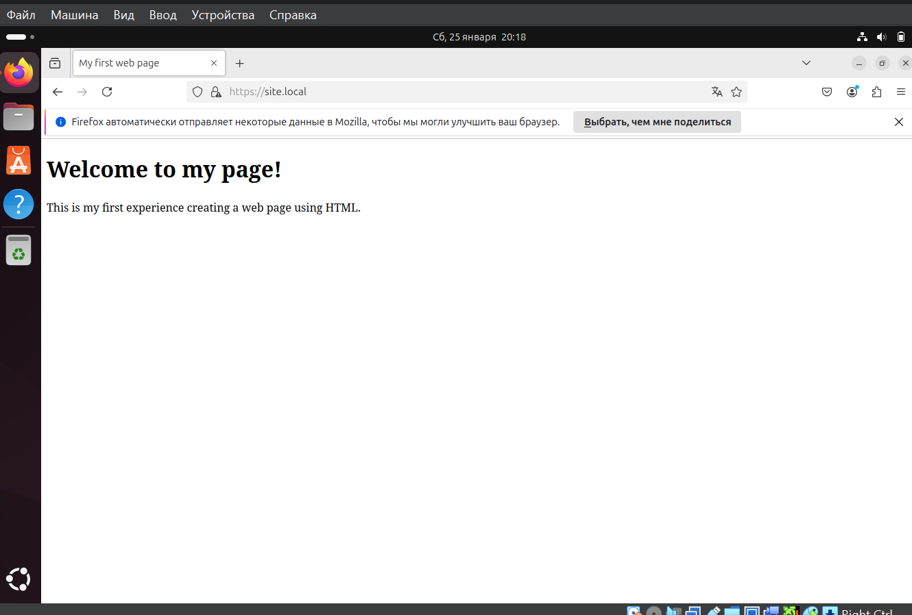
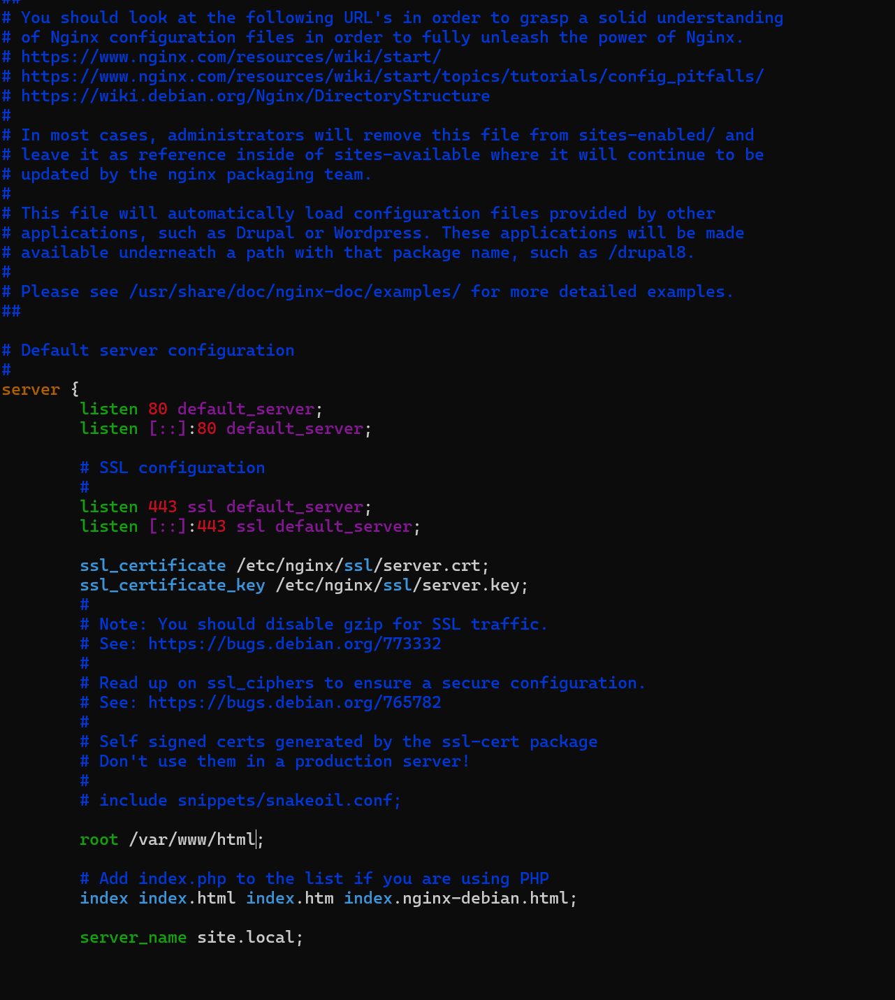
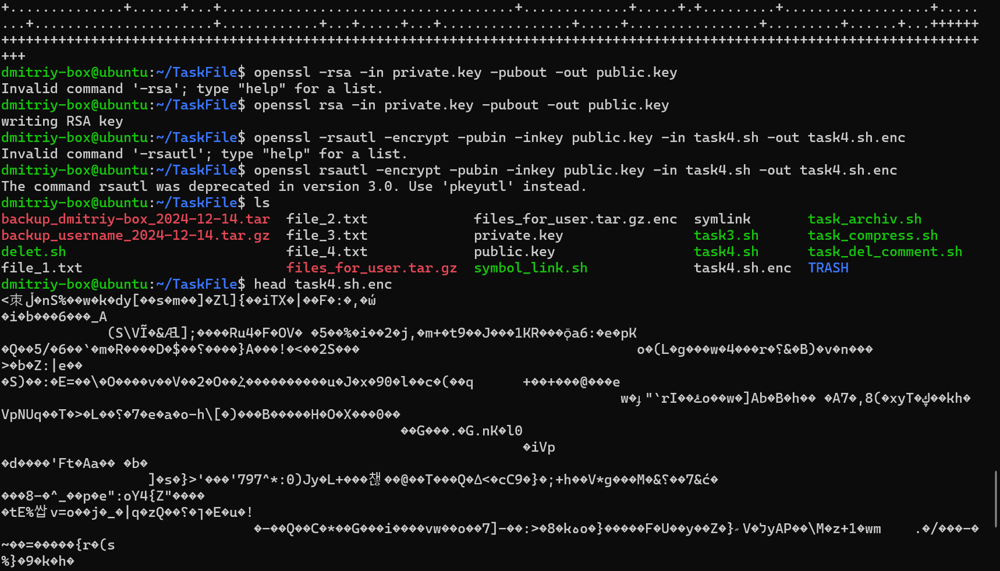
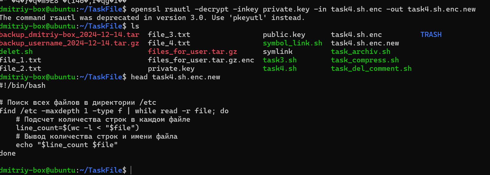

### Задание 1

> Цель задания
Научиться работать с OpenSSL и симметричными шифрами.

> Что нужно сделать
Представьте, что вам нужно безопасно передать кому-то несколько текстовых файлов. Запакуйте эти файлы в tar.gz архив и зашифруйте его с помощью симметричного шифрования.

> Проверьте, что вы сможете затем расшифровать и распаковать архив.

> Что оценивается
Правильность использования инструментов.

### Задание 2
> Цель задания
Потренироваться в использовании утилиты для вычисления хеш-суммы.

> Что нужно сделать
Письменно ответьте на вопрос: изменится ли хеш текстового файла, если добавить в него пустую строку? Напомню, что для вычисления хеш-суммы можно использовать команду md5sum.

### Задание 3
> Цель задания
Отработать на практике создание самоподписанных сертификатов и настройку работы Nginx с SSL.

> Что нужно сделать
Сгенерируйте самоподписанный сертификат и настройте Nginx на работу по HTTPS для тестовой веб-странички, как было показано на уроке.

### Задание 4
> Цель задания
Самостоятельно познакомиться с генерацией ключевой пары при помощи утилиты openssl и шифрованием файла — при помощи асимметричной криптографии.

> Что нужно сделать
Воспользовавшись инструкцией, сгенерируйте ключевую пару «открытый и закрытый ключ». При помощи открытого ключа зашифруйте файл. Затем расшифруйте его при помощи приватного ключа. Убедитесь, что зашифрованный файл нельзя прочитать как текстовый, а расшифрованный файл совпадает с исходным.

> Инструкция:

> Генерируем приватный ключ
openssl genpkey -algorithm RSA -out private.key -pkeyopt rsa_keygen_bits:8192
Извлекаем из приватного ключа публичный ключ
openssl rsa -in private.key -pubout -out public.key
Шифруем файл
openssl rsautl -encrypt -pubin -inkey публичный_ключ.key -in файл_с_открытым_текстом.txt -out зашифрованный_файл.txt.enc
Расшифровываем файл
openssl rsautl -decrypt -inkey приватный_ключ.key -in зашифрованный_файл.txt.enc  -out файл_с_открытым_текстом.txt.new
Что оценивается
Правильность использования инструментов.

