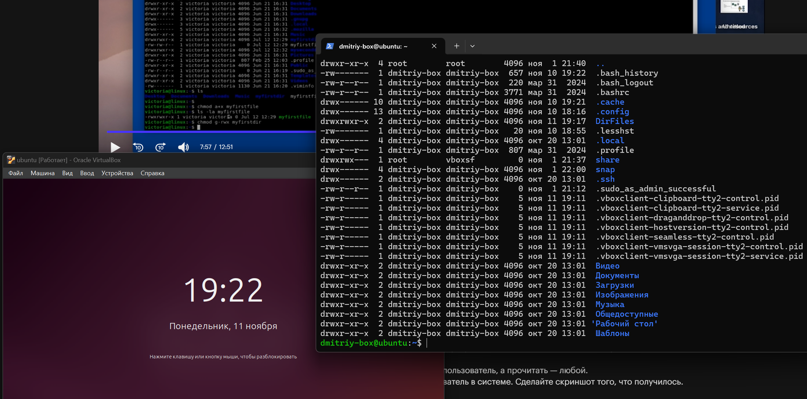
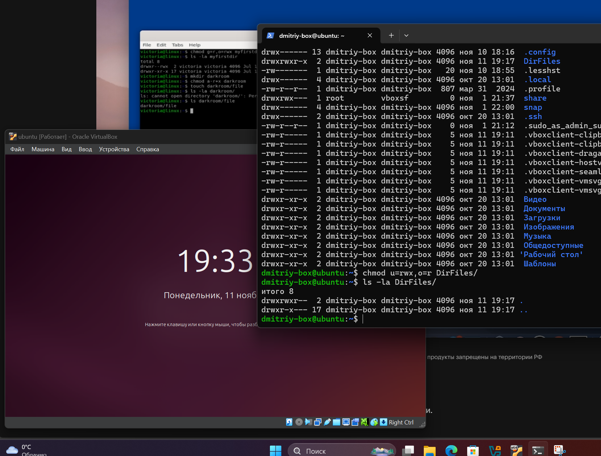
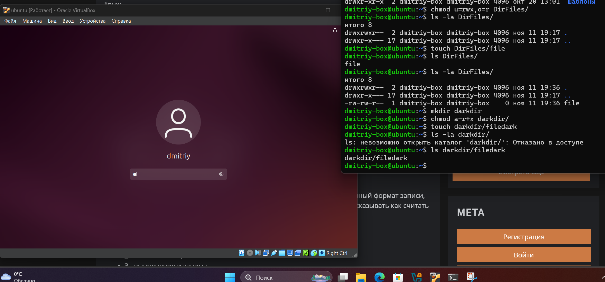
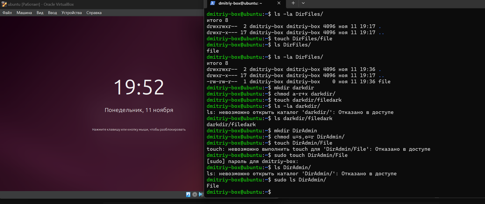
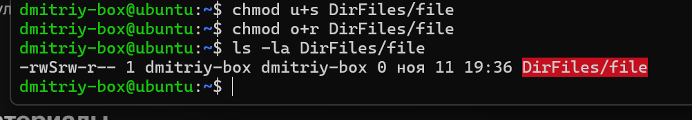
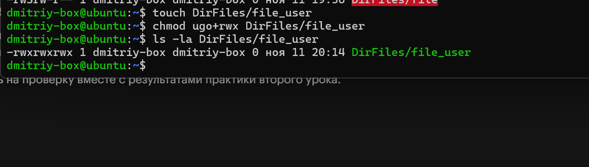

1. Создайте папку, в которой только ваш пользователь сможет создавать и удалять файлы, а остальные пользователи — только просматривать список файлов.
 
---

2. Создайте темный каталог. Покажите, что получить список файлов нельзя, но можно получить доступ к файлу, зная его имя. Сделайте скриншот того, что получилось.
   
3. Создайте папку, доступ на запись в которую есть только у суперпользователя, а доступ на чтение — у всех.   Попробуйте создать в ней файл. Теперь попробуйте создать файл с правами суперпользователя (использовав команду sudo). Сделайте скриншот того, что получилось.
   
4. Создайте файл, отредактировать который сможет только суперпользователь, а прочитать — любой.
   
5. Создайте файл, полный доступ к которому имеет любой пользователь в системе. Сделайте скриншот того, что получилось.
   